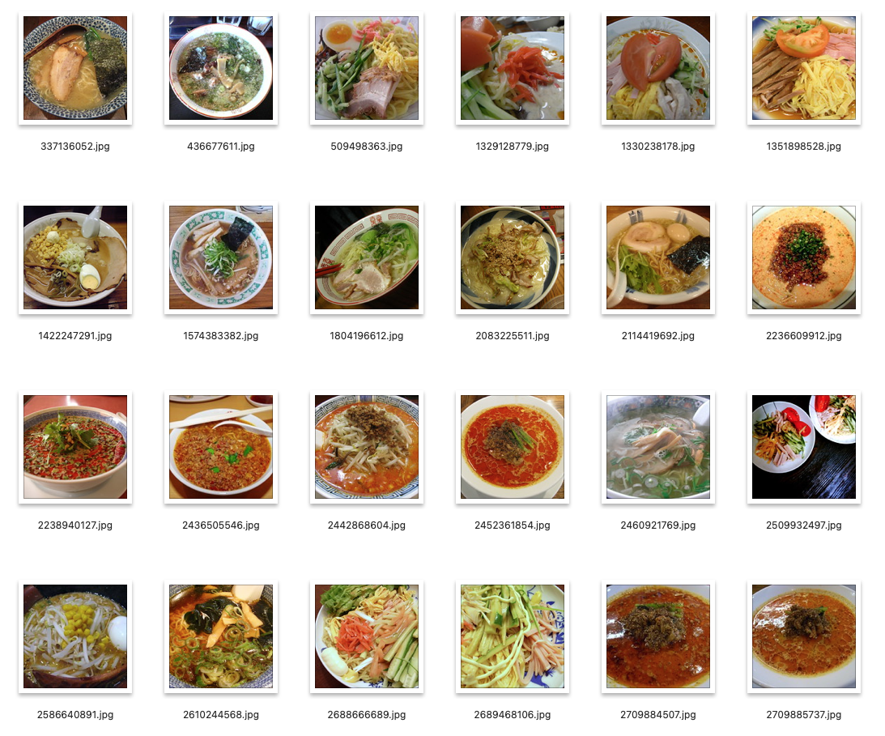

# ラーメン画像のデータセット

著作権的問題のない大量のラーメン画像をダウンロードして、分類したものです。
Creative Commons 営利利用可のものだけをダウンロードしました。

ソースは、Flickrで、「ラーメン」「ramen」、またそれぞれのキーワードでダウンロードして分類を行いました。

ここでは、dataディレクトリ以下に、ラーメンの種類ごとに分類しています。

- 塩ラーメン: salt
- 醤油ラーメン: soya_source
- 担々麺: spicy
- 味噌ラーメン: miso
- 冷やし中華: chilled

## 画像情報

- 画像トータル枚数: 426枚
- 画像サイズ (150x150)
- 機械学習用途のために制作

# Ramen Image Dataset

A large collection of ramen images without copyright issues has been downloaded and categorized. Only those available under Creative Commons for commercial use were downloaded.

The sources include Flickr, using the keywords "ラーメン" and "ramen". The images were downloaded and categorized according to these keywords.

Here, the data directory is organized by different types of ramen.

- Salt Ramen - salt
- Soy Sauce Ramen - soya_source
- Spicy Sesame Ramen - spicy
- Miso Ramen - miso
- Chilled Chinese Noodles - chilled

## Image Information

- Total number of images: 426
- Image size: 150x150
- Created for machine learning purposes

